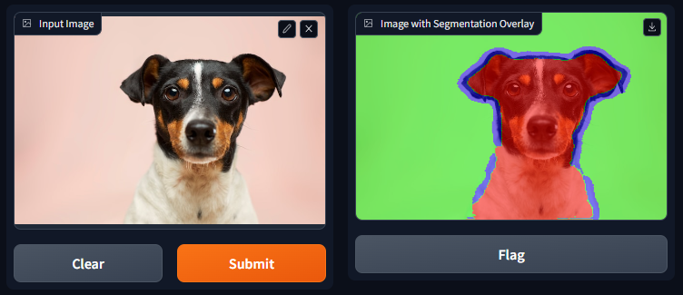

# Pet Image Segmentation using PyTorch

[](https://huggingface.co/spaces/soumyaprabhamaiti/pet-image-segmentation-pytorch)

This project focuses on segmenting pet images into three classes: background, pet, and boundary using a [U-Net](https://arxiv.org/abs/1505.04597) model implemented in PyTorch. The model is trained on [Oxford-IIIT Pet Dataset](https://www.robots.ox.ac.uk/~vgg/data/pets/) and the web app for inference is deployed using [Gradio](https://gradio.app/).

## Webapp Demo

The deployed version of this project can be accessed at [Hugging Face Spaces](https://huggingface.co/spaces/soumyaprabhamaiti/pet-image-segmentation-pytorch). Segmentation on a sample image is shown below:


## Installing Locally

1. Clone the repository:
    ```
    git clone https://github.com/soumya-prabha-maiti/pet-image-segmentation-pytorch.git
    ```

1. Navigate to the project folder:
    ```
    cd pet-image-segmentation-pytorch
    ```

1. Create and activate a virtual environment:
    ```
    python -m venv env
    source env/bin/activate  # On Windows use `env\Scripts\activate`
    ```

1. Install the required libraries:
    ```
    pip install -r requirements.txt
    ```

1. Run the application:
    ```
    python run_webapp.py
    ```

## Dataset

The [Oxford-IIIT Pet Dataset](https://www.robots.ox.ac.uk/~vgg/data/pets/) contains 37 categories of pets with roughly 200 images for each category. The images have a large variation in scale, pose and lighting. All images have an associated ground truth annotation of breed, head ROI, and pixel level trimap segmentation. Here the dataset was obtained using Torchvision.

## Model Architecture

The segmentation model uses the UNET architecture. The basic architecture of the UNET model is shown below:


The UNET model consists of an encoder and a decoder. The encoder is a series of convolutional layers that extract features from the input image. The decoder is a series of transposed convolutional layers that upsample the features to the original image size. Skip connections are used to connect the encoder and decoder layers. The skip connections concatenate the feature maps from the encoder to the corresponding feature maps in the decoder. This helps the decoder to recover the spatial information lost during the encoding process.

<details>
    <summary>Detailed architecture of the UNET model used in this project</summary>

    ==========================================================================================
    Layer (type:depth-idx)                   Output Shape              Param #
    ==========================================================================================
    UNet                                     [16, 3, 128, 128]         --
    ├─ModuleList: 1-9                        --                        (recursive)
    │    └─DoubleConvOriginal: 2-1           [16, 16, 128, 128]        --
    │    │    └─Sequential: 3-1              [16, 16, 128, 128]        --
    │    │    │    └─Conv2d: 4-1             [16, 16, 128, 128]        432
    │    │    │    └─BatchNorm2d: 4-2        [16, 16, 128, 128]        32
    │    │    │    └─ReLU: 4-3               [16, 16, 128, 128]        --
    │    │    │    └─Conv2d: 4-4             [16, 16, 128, 128]        2,304
    │    │    │    └─BatchNorm2d: 4-5        [16, 16, 128, 128]        32
    │    │    │    └─ReLU: 4-6               [16, 16, 128, 128]        --
    ├─MaxPool2d: 1-2                         [16, 16, 64, 64]          --
    ├─ModuleList: 1-9                        --                        (recursive)
    │    └─DoubleConvOriginal: 2-2           [16, 32, 64, 64]          --
    │    │    └─Sequential: 3-2              [16, 32, 64, 64]          --
    │    │    │    └─Conv2d: 4-7             [16, 32, 64, 64]          4,608
    │    │    │    └─BatchNorm2d: 4-8        [16, 32, 64, 64]          64
    │    │    │    └─ReLU: 4-9               [16, 32, 64, 64]          --
    │    │    │    └─Conv2d: 4-10            [16, 32, 64, 64]          9,216
    │    │    │    └─BatchNorm2d: 4-11       [16, 32, 64, 64]          64
    │    │    │    └─ReLU: 4-12              [16, 32, 64, 64]          --
    ├─MaxPool2d: 1-4                         [16, 32, 32, 32]          --
    ├─ModuleList: 1-9                        --                        (recursive)
    │    └─DoubleConvOriginal: 2-3           [16, 64, 32, 32]          --
    │    │    └─Sequential: 3-3              [16, 64, 32, 32]          --
    │    │    │    └─Conv2d: 4-13            [16, 64, 32, 32]          18,432
    │    │    │    └─BatchNorm2d: 4-14       [16, 64, 32, 32]          128
    │    │    │    └─ReLU: 4-15              [16, 64, 32, 32]          --
    │    │    │    └─Conv2d: 4-16            [16, 64, 32, 32]          36,864
    │    │    │    └─BatchNorm2d: 4-17       [16, 64, 32, 32]          128
    │    │    │    └─ReLU: 4-18              [16, 64, 32, 32]          --
    ├─MaxPool2d: 1-6                         [16, 64, 16, 16]          --
    ├─ModuleList: 1-9                        --                        (recursive)
    │    └─DoubleConvOriginal: 2-4           [16, 128, 16, 16]         --
    │    │    └─Sequential: 3-4              [16, 128, 16, 16]         --
    │    │    │    └─Conv2d: 4-19            [16, 128, 16, 16]         73,728
    │    │    │    └─BatchNorm2d: 4-20       [16, 128, 16, 16]         256
    │    │    │    └─ReLU: 4-21              [16, 128, 16, 16]         --
    │    │    │    └─Conv2d: 4-22            [16, 128, 16, 16]         147,456
    │    │    │    └─BatchNorm2d: 4-23       [16, 128, 16, 16]         256
    │    │    │    └─ReLU: 4-24              [16, 128, 16, 16]         --
    ├─MaxPool2d: 1-8                         [16, 128, 8, 8]           --
    ├─ModuleList: 1-9                        --                        (recursive)
    │    └─DoubleConvOriginal: 2-5           [16, 256, 8, 8]           --
    │    │    └─Sequential: 3-5              [16, 256, 8, 8]           --
    │    │    │    └─Conv2d: 4-25            [16, 256, 8, 8]           294,912
    │    │    │    └─BatchNorm2d: 4-26       [16, 256, 8, 8]           512
    │    │    │    └─ReLU: 4-27              [16, 256, 8, 8]           --
    │    │    │    └─Conv2d: 4-28            [16, 256, 8, 8]           589,824
    │    │    │    └─BatchNorm2d: 4-29       [16, 256, 8, 8]           512
    │    │    │    └─ReLU: 4-30              [16, 256, 8, 8]           --
    ├─MaxPool2d: 1-10                        [16, 256, 4, 4]           --
    ├─DoubleConvOriginal: 1-11               [16, 512, 4, 4]           --
    │    └─Sequential: 2-6                   [16, 512, 4, 4]           --
    │    │    └─Conv2d: 3-6                  [16, 512, 4, 4]           1,179,648
    │    │    └─BatchNorm2d: 3-7             [16, 512, 4, 4]           1,024
    │    │    └─ReLU: 3-8                    [16, 512, 4, 4]           --
    │    │    └─Conv2d: 3-9                  [16, 512, 4, 4]           2,359,296
    │    │    └─BatchNorm2d: 3-10            [16, 512, 4, 4]           1,024
    │    │    └─ReLU: 3-11                   [16, 512, 4, 4]           --
    ├─ModuleList: 1-12                       --                        --
    │    └─ConvTranspose2d: 2-7              [16, 256, 8, 8]           524,544
    │    └─DoubleConvOriginal: 2-8           [16, 256, 8, 8]           --
    │    │    └─Sequential: 3-12             [16, 256, 8, 8]           --
    │    │    │    └─Conv2d: 4-31            [16, 256, 8, 8]           1,179,648
    │    │    │    └─BatchNorm2d: 4-32       [16, 256, 8, 8]           512
    │    │    │    └─ReLU: 4-33              [16, 256, 8, 8]           --
    │    │    │    └─Conv2d: 4-34            [16, 256, 8, 8]           589,824
    │    │    │    └─BatchNorm2d: 4-35       [16, 256, 8, 8]           512
    │    │    │    └─ReLU: 4-36              [16, 256, 8, 8]           --
    │    └─ConvTranspose2d: 2-9              [16, 128, 16, 16]         131,200
    │    └─DoubleConvOriginal: 2-10          [16, 128, 16, 16]         --
    │    │    └─Sequential: 3-13             [16, 128, 16, 16]         --
    │    │    │    └─Conv2d: 4-37            [16, 128, 16, 16]         294,912
    │    │    │    └─BatchNorm2d: 4-38       [16, 128, 16, 16]         256
    │    │    │    └─ReLU: 4-39              [16, 128, 16, 16]         --
    │    │    │    └─Conv2d: 4-40            [16, 128, 16, 16]         147,456
    │    │    │    └─BatchNorm2d: 4-41       [16, 128, 16, 16]         256
    │    │    │    └─ReLU: 4-42              [16, 128, 16, 16]         --
    │    └─ConvTranspose2d: 2-11             [16, 64, 32, 32]          32,832
    │    └─DoubleConvOriginal: 2-12          [16, 64, 32, 32]          --
    │    │    └─Sequential: 3-14             [16, 64, 32, 32]          --
    │    │    │    └─Conv2d: 4-43            [16, 64, 32, 32]          73,728
    │    │    │    └─BatchNorm2d: 4-44       [16, 64, 32, 32]          128
    │    │    │    └─ReLU: 4-45              [16, 64, 32, 32]          --
    │    │    │    └─Conv2d: 4-46            [16, 64, 32, 32]          36,864
    │    │    │    └─BatchNorm2d: 4-47       [16, 64, 32, 32]          128
    │    │    │    └─ReLU: 4-48              [16, 64, 32, 32]          --
    │    └─ConvTranspose2d: 2-13             [16, 32, 64, 64]          8,224
    │    └─DoubleConvOriginal: 2-14          [16, 32, 64, 64]          --
    │    │    └─Sequential: 3-15             [16, 32, 64, 64]          --
    │    │    │    └─Conv2d: 4-49            [16, 32, 64, 64]          18,432
    │    │    │    └─BatchNorm2d: 4-50       [16, 32, 64, 64]          64
    │    │    │    └─ReLU: 4-51              [16, 32, 64, 64]          --
    │    │    │    └─Conv2d: 4-52            [16, 32, 64, 64]          9,216
    │    │    │    └─BatchNorm2d: 4-53       [16, 32, 64, 64]          64
    │    │    │    └─ReLU: 4-54              [16, 32, 64, 64]          --
    │    └─ConvTranspose2d: 2-15             [16, 16, 128, 128]        2,064
    │    └─DoubleConvOriginal: 2-16          [16, 16, 128, 128]        --
    │    │    └─Sequential: 3-16             [16, 16, 128, 128]        --
    │    │    │    └─Conv2d: 4-55            [16, 16, 128, 128]        4,608
    │    │    │    └─BatchNorm2d: 4-56       [16, 16, 128, 128]        32
    │    │    │    └─ReLU: 4-57              [16, 16, 128, 128]        --
    │    │    │    └─Conv2d: 4-58            [16, 16, 128, 128]        2,304
    │    │    │    └─BatchNorm2d: 4-59       [16, 16, 128, 128]        32
    │    │    │    └─ReLU: 4-60              [16, 16, 128, 128]        --
    ├─Conv2d: 1-13                           [16, 3, 128, 128]         51
    ==========================================================================================
    Total params: 7,778,643
    Trainable params: 7,778,643
    Non-trainable params: 0
    Total mult-adds (Units.GIGABYTES): 17.01
    ==========================================================================================
    Input size (MB): 3.15
    Forward/backward pass size (MB): 595.59
    Params size (MB): 31.11
    Estimated Total Size (MB): 629.85
    ==========================================================================================
</details>

## Libraries Used

The following libraries were used in this project:

- PyTorch + PyTorch Lightning : To build segmentation model.
- Gradio : To create the user interface for the segmentation app.

## License

This project is licensed under the [MIT License](LICENSE).